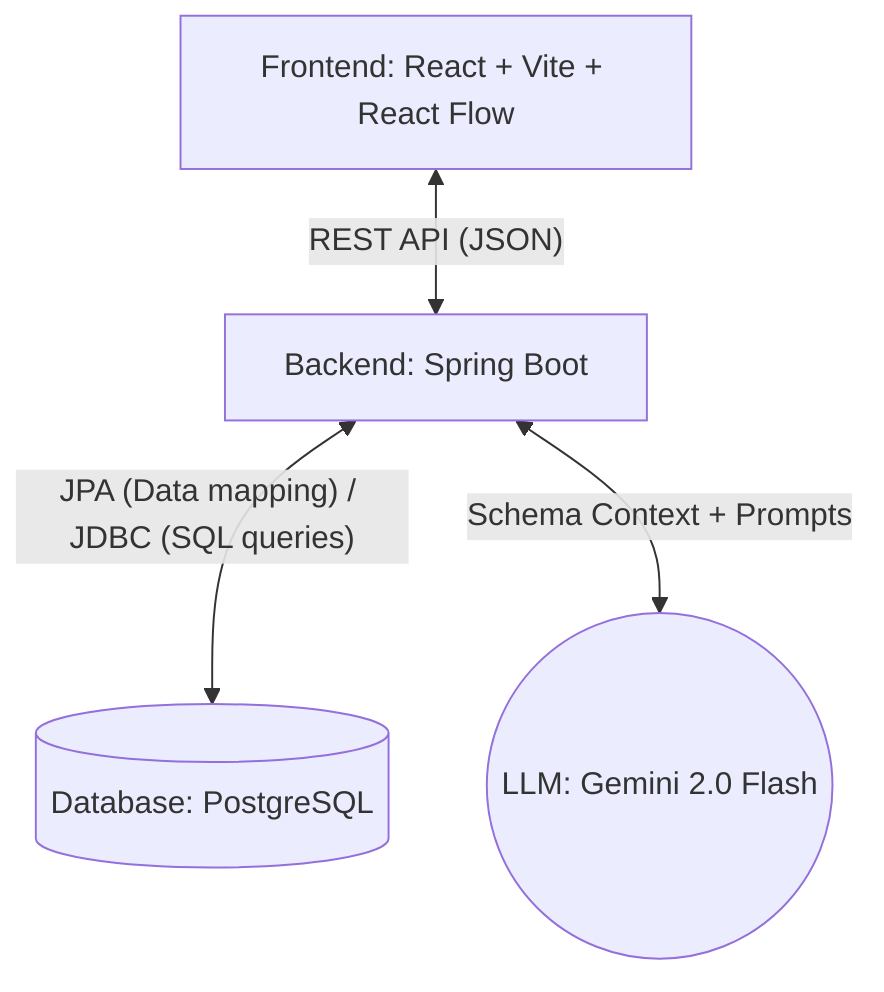

# Graph-Based Business Data Exploration System

This project is a full-stack web application designed to unify fragmented business data (e.g., orders, deliveries, invoices, and payments) into a graph of interconnected entities. It provides a React-based UI for graph visualization and features an LLM-powered natural language chat interface to dynamically translate user questions into structured SQL queries, providing data-backed answers.

## Architecture Decisions

The system relies on a three-tier architecture:
1. **Frontend:** React + Vite, using `@xyflow/react` for the customizable and interactive graph visualization.
2. **Backend:** Spring Boot (Java 17+), exposing RESTful APIs for the graph overview, paginated entity data tables, and the LLM query pipeline.
3. **Database:** PostgreSQL. 

The choice to use a relational database with foreign key relationships over a native graph database (like Neo4j) was driven by the inherent rectangular shape of SAP O2C data (JSONL). The relational approach makes aggregation and complex joins significantly easier, faster, and more standard for LLMs to generate queries against while still allowing us to conceptualize and visualize the data as a graph via the frontend.

## Database Mapping

The JSONL dataset was ingested and modeled into the following interconnected JPA entities:
- **Business Partner:** Central node (Customer).
- **Sales Orders:** `SalesOrderHeader` and `SalesOrderItem`.
- **Outbound Deliveries:** `OutboundDeliveryHeader` and `OutboundDeliveryItem`.
- **Billing Documents:** `BillingDocumentHeader` and `BillingDocumentItem`.
- **Payments:** `PaymentAccountsReceivable`.
- **Products:** `Product`.

### Graph Structure
- `Business Partner` **places** `Sales Orders`
- `Sales Orders` **contains** `Sales Order Items`
- `Sales Order Items` **reference** `Products`
- `Sales Orders` **delivered by** `Deliveries`
- `Sales Orders` **billed by** `Billing Documents`
- `Billing Documents` **paid by** `Payments`
- `Business Partner` **pays via** `Payments`

## LLM Prompting Strategy

Integrating the Gemini 2.0 Flash API to generate dynamic SQL introduces the risk of hallucination or syntax errors. 

**Context Prompting:** 
To solve this, the LLM is primed with a highly detailed, rigid system prompt encompassing the entire PostgreSQL database schema. The prompt includes precisely mapping out primary keys, foreign keys (e.g., `sales_order_header.sold_to_party -> business_partner.customer`), and data types.

**Temperature Control:**
The API is called with a temperature of `0.1` to force deterministic, logic-based responses rather than creative text generation. The LLM is explicitly instructed to only output raw SQL query text based on the schema matching the user's natural language question.

## Guardrails

To prevent the LLM from executing destructive queries (SQL Injection) or answering out-of-scope questions, a strict `SqlValidationService` acts as a middleware in the process:

1. **Read-Only Enforcement:** The LLM's raw SQL output is intercepted. If it contains any DML or DDL keywords (e.g., `INSERT`, `UPDATE`, `DELETE`, `DROP`, `ALTER`, `TRUNCATE`), the system actively blocks execution.
2. **Whitelist Pattern:** The system aggressively ensures the query strictly begins with `SELECT`.
3. **Out-of-Scope Rejection:** As per the instructions in the prompt, if the user asks a general knowledge or creative question completely disjoint from the provided SAP O2C schema, the system will reject it with: `"This system is designed to answer questions related to the provided dataset only."`
4. **Statement Boundaries:** The validator looks for semicolons to prevent multi-statement injection vulnerabilities.

## How to Run Locally

### Prerequisites
- JDK 17+
- Node.js
- PostgreSQL running on port 5433 (or update `application.properties`)
- Gemini API Key

### Backend Setup
1. Define your environment variable: `export GEMINI_API_KEY=your_key_here`
2. Navigate to `appBackend`
3. Run `mvn spring-boot:run`
*Note: The application will automatically ingest the JSONL files from `../sap-o2c-data` on initial startup.*

### Frontend Setup
1. Navigate to `appFrontend`
2. Run `npm install`
3. Run `npm run dev`
4. Access the dashboard via your browser.
